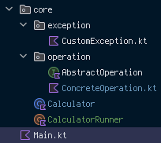

<p align = "center">
    
    
</p>

# C a l c u l a t o r
스파르타코딩클럽 내일배움캠프 [`Kotlin` + `Spring`] 트랙 2기 2주차 프로그래밍 기본과제: 계산기 프로그램

---

## 목차
0. [개발 환경](#0-개발-환경)
1. [과제 요구사항](#1-과제-요구사항)
2. [프로그램 흐름도](#2-프로그램-흐름도)
3. [패키지 / 클래스 구조 및 설명](#3-패키지--클래스-구조-및-설명)
   - 3-1. [패키지 구조](#3-1-패키지-구조)
   - 3-2. [클래스 설명](#3-2-클래스-설명)

---

## 0. 개발 환경
| 기준  | 내용                             |
|-----|--------------------------------|
| OS  | `Windows 11 Home 23H2`           |
| IDE | `IntelliJ IDEA 2024.1`           |
| SDK | `OpenJDK 17.0.3` + `Kotlin 1.9.23` |

---

## 1. 과제 요구사항
- [v] `Lv. 1`: 사칙연산(덧셈, 뺄셈, 곱셈, 나눗셈) 연산 수행이 가능한 `Calculator` 클래스 생성, 이걸 이용하여 연산 진행/출력
- [v] `Lv. 2`: `Lv. 1`의 `Calculator`에 나머지 연산 기능 추가
- [v] `Lv. 3`: 사칙연산 기능을 각 연산 당 **별도의 클래스로 분리하여 구현**한 후, `Calculator` 클래스에서 사용
- [v] `Lv. 4`: (선택적) `Lv. 3`에서 만든 연산 클래스들을 `AbstractOperation` 추상 클래스/인터페이스에서 상속/구현하여 사용하는 것으로 변경

---

## 2. 프로그램 흐름도

### 2-1. 기본 흐름

`Main.kt`에 적힌 `main`의 흐름을 의사 코드(pseudocode)로 표현했을 땐 다음과 같습니다:
```pseudocode
아래를 *무한히* 반복:
    사용자의 식 입력을 받는다
    
    만약 "clear"를 입력 받았을 경우
        계산기 메모리를 초기화한다
    만약 "exit"을 입력 받았을 경우
        반복을 종료한다
    
    계산기에 식을 넣어 연산을 진행한다
    계산기로부터 결과값을 받아 출력한다
```

### 2-2. 실행 방법

```
Enter expression: 
```

실행 시 반복적으로 위 메세지로 입력을 물어봅니다. 그러면 사용자는 식을 **다음 둘 중 하나의 방법을 선택**하여 넣어줄 수 있습니다:
1. 피연산자 둘과 연산자 하나로 구성된 식을 **공백 하나로 서로를 구분할 수 있게** 입력
   ```
   Enter expression: 5.0 + 3
   ```
   피연산자로 **정수와 실수 둘 다** 넣어줄 수 있습니다. 단 계산 후 결과값은 **정수로 표현될 수 있을 경우 정수로 표현**합니다:

   ```
   Enter expression: 5.0 + 3
   5 + 3 = 8
   ```
2. **연산자가 먼저 오고 그 다음 피연산자가 오는** 식을 입력
   ```
   Enter expression: * 3
   ```

   이 경우 **계산기 메모리에 남이있는 결과값을 자동으로 좌항 피연산자로 넣어 계산**합니다:
   ```
   Enter expression: 5.0 + 3
   5 + 3 = 8
   
   Enter Expression: * 3.5
   8 * 3.5 = 28
   ```

다음과 같은 경우엔 **오류를 일으킵니다**:
- 연산자 혹은 피연산자로 가공이 불가능한 - 연산자에 사칙연산과 나머지 기호(`+`, `-`, `*`, `/`, `%`)를 제외한 기호가 들어오거나 피연산자에 숫자를 제외한 나머지 - 문자가 들어올 경우
    ```
    Enter expression: 5 & 3
    Wrong expression!
    Wrong operator: &
    ```
    ```
    Enter expression: 2 * PI
    Wrong expression!
    Unparsable expression: 2 * PI
    ```
    - 단 다음과 같이 실수 피연산자에 `f`/`F` 접미사가 붙은 경우 **부동점 실수 리터럴로 인식**하여 오류가 일어나지 않습니다:
        ```
        Enter expression: * 5.0f
        0 * 5 = 0
        ```
    - 이외의 리터럴에 대해선 오류가 일어납니다(실수로 변환하기 때문에 해당 리터럴(`f`, `F`)만 인식함):
        ```
        Enter expression: + 30L
        Wrong expression!
        Unparsable expression: + 30L
        ```

- 나눗셈/나머지 연산 진행 시 우항 피연산자에 0이 들어오는 경우
  ```
  Enter expression: 10 / 0
  Wrong expression!
  Invalid division: cannot divide by zero
  
  Enter expression: 10 % 0
  Wrong expression!
  Invalid division: cannot divide by zero
  ```


식이 아닌 일반 문자열이 들어올 수 있으나, 다음 둘 중 하나가 아니라면(_대소문자 구분 없음_) **오류를 일으킵니다**:
1. `clear`: 계산기 메모리 초기화
   ```
   Enter expression: clear
   Calculator memory has been reset.
   ```
2. `exit`: 프로그램 종료
   ```
   Enter expression: exit
   Shutting down...
   ```
3. 그 외의 (식으로 볼 수 없는) 입력: 분석 오류 메세지 출력
   ```
   Enter expression: reset
   Wrong expression!
   Unparsable expression: reset
   ```

---

## 3. 패키지 / 클래스 구조 및 설명

### 3-1. 패키지 구조
패키지명엔 **모두 소문자로**, 클래스명은 `PascalCase`로 구분 및 식별하였습니다:



- `spartacodingclub.nbcamp.kotlinspring.assignment`: 기본 과제 그룹
  - `core`: 주요 기능들이 속한 패키지
    - `Calculator`: 계산기 시뮬레이션 `class`
      - `operation`: 연산 패키지
        - `AbstractOperation`: 아래 연산 클래스들의 `interface`
        - `ConcreteOperation.kt`: `AbstractOperation` `interface`를 구현한 `class`들이 보관된 곳
          - `AddOperation`: 덧셈 연산 `class`
          - `SubtractOperation`: 뺄셈 연산 `class`
          - `MultiplyOperation`: 곱셈 연산 `class`
          - `DivideOperation`: 나눗셈 연산 `class`
          - `RemainderOperation`: 나머지 연산 `class`
      - `exception`: 계산기 시뮬레이션 사용 중 발생할 수 있는 문제들을 예외로 표현하여 넣어둔 패키지
        - `CustomException.kt`: 계산기 시뮬레이션 사용 중 발생할 수 있는 문제들을 예외로 표현하여 넣어둔 패키지
          - `DivisionByZeroException`: 0으로 나눌 때 발생시키는 예외
          - `InvalidOperatorException`: 올바르지 않은 연산자가 들어왔을 때 발생시키는 예외
          - `UnparsableExpressionException`: 계산식을 식별할 수 없을 때 발생시키는 예외

### 3-2. 클래스 설명

#### 3-2-1. `core.Calculator`
계산기를 시연하는 클래스. `Main.kt`에서 해당 인스턴스를 생성하여 사용하되, 직접적으로 사용하는 함수는 `calculate`, `clearMemory`, `getResult` 이 3가지입니다.

##### 3-2-1-1. `Calculator.calculate`
```kotlin
fun calculate(expressionInput: String)
```

주어진 표현식을 받아 계산을 진행합니다. 의사 코드로 표현한 작동 방식은 다음과 같습니다:
```pseudocode
입력받은 표현식을 내부 변수에 저장한다
표현식을 가공한다(`parseExpression`)

표현식에 문제가 없었는지 오류 플래그들을 체크한다
표현식에 문제가 없을 경우
    메모리에 (계산 전) 마지막 결과값을 저장한다
    연산 모듈(`operation`)을 통해 값을 계산(`calculate`)하여 결과값에 저장한다
```

표현식 가공을 위해 내부적으로 `parseExpression`을 사용합니다.

###### 3-2-1-1-1. `Calculator.parseExpression`
```kotlin
private fun parseExpression()
```

주어진 표현식을 가공하여 각각의 프로퍼티 - 연산자, 연산 모듈, 오류 플래그 - 에 값을 담습니다. 의사 코드로 표현한 작동 방식은 다음과 같습니다:
```pseudocode
오류 플래그들을 초기화한다

표현식을 공백으로 분리하여 목록을 만든다
목록 길이가 2 혹은 3이 아닌 경우(각각 [연산자 + 피연산자] 조합과 [피연산자 + 연산자 + 피연산자] 조합으로 구성됨을 의미함)
    가공 오류에 대한 예외를 처리한다:
        가공 오류 플래그를 켠다
예전 결과값을 참고해야 하는지 확인한다

좌항 피연산자 - 연산자 - 우항 피연산자를 가공하여 각각 실수 - 문자열 - 실수 형태로 담는다
    좌항 피연산자가 없는 경우 여기에 예전 결과값을 담는다

연산자에 따라 연산 모듈에 `operation`에 새 인스턴스를 생성한다
    나눔/나머지 연산자가 들어왔을 경우 우항 피연산자가 0(혹은 0.0)일 경우
        0으로 나눔에 대한 예외를 처리한다:
            0으로 나눔 오류 플래그를 켠다
    연산자가 주어진 5개 - '+', '-', '*', '/', '%' - 중에 없을 경우
        알 수 없는 연산자에 대한 예외를 처리한다:
            올바르지 않은 연산자 오류 플래그를 켠다
```

##### 3-2-1-2. `Calculator.getResult`
```kotlin
fun getResult(): String
```

계산 결과를 문자열로 만들어 반환합니다. 표현식에 오류가 없을 경우 (**입력받은 표현식을 간략화한 것을 포함한**) 결과값을, 그렇지 않을 경우 오류 메세지를 만들어 반환합니다.

###### 3-2-1-2-1. `Calculator.simplify`
```kotlin
private fun simplify(value: Double): Any 
```

실수 값을 패러미터로 받아, 정수로 표현할 수 있을 경우 - 소수점 부분이 없을 경우 - 정수로 변환한 값을, 그렇지 않을 경우 원래의 값을 반환합니다.

###### 3-2-1-2-2. `Calculator.getFullExpression`
```kotlin
private fun getFullExpression(): String 
```

입력받은 표현식과 그 결과를 아래의 형태로 조합하여 문자열 형태로 반환합니다:

```
<좌항 피연산자> <연산자> <우항 피연산자> = <결과값>
```

이 때 연산자를 제외한 모든 항목들은 정수로 표현될 수 있을 경우 **간략화**(`Calculator.simplify`)하여 - 소수점을 없애서 - 표현합니다.

###### 3-2-1-2-3. `Calculator.getErrorMessage`
```kotlin
private fun getErrorMessage(): String
```

입력받은 표현식을 가공하면서 발생한 오류들을 하나의 문자열로 표현하여 아래의 형식으로 반환합니다:

```
Wrong Expression!
<오류 #1>
...
```

##### 3-2-1-3. `Calculator.clearMemory`
```kotlin
fun clearMemory()
```

계산기 시뮬레이터에 있는 메모리(이전 결과값)을 0으로 초기화합니다.


#### 3-2-2. `core.operation`
계산기 시뮬레이터의 연산 모듈로 사용되는 패키지입니다. 기본 틀(인터페이스) `AbstractOperation`을 기반으로 5개 연산 - 사칙연산과 나머지 연산 - 에 대한 연산자 클래스가 소속되어 있습니다.
- `AbstractOperation`: 연산 모듈 인터페이스. `operate`로 결과값을 계산하는 틀을 제공합니다.
- `AddOperation`: 덧셈 연산 모듈
- `SubtractOperation`: 뺄셈 연산 모듈
- `MultiplyOperation`: 곱셈 연산 모듈
- `DivideOperation`: 나눗셈 연산 모듈
- `RemainderOperation`: 나머지 연산 모듈

#### 3-2-3. `core.exception`
표현식을 가공하면서 발생하는 오류들을 정의하는 예외들이 들어가 있는 패키지입니다.
- `DivisionByZeroException`: 나눗셈 혹은 나머지 연산을 진행할 때 우항 피연산자가 0일 경우 발생하는 예외입니다.
- `InvalidOperatorException`: 연산자로 인식할 수 없는 - 사칙연산과 나머지 연산(`+`, `-`, `*`, `/`, `%`)을 제외한 나머지 기호가 들어왔을 경우 - 발생하는 예외입니다.
- `UnparsableExpressionException`: 표현식이 가공할 수 없는 형식 - 공백을 기준으로 나누었을 때 2~3개 묶음이 나오지 않는 식 - 으로 들어왔을 경우 발생하는 예외입니다.

## 4. 개선 필요 부분
- 피연산자에 실수값으로 변환이 불가능한 문자가 들어왔을 경우 *표현식으로 인식할 수 없는 (본석) 오류와 다른* 오류를 출력하는 것